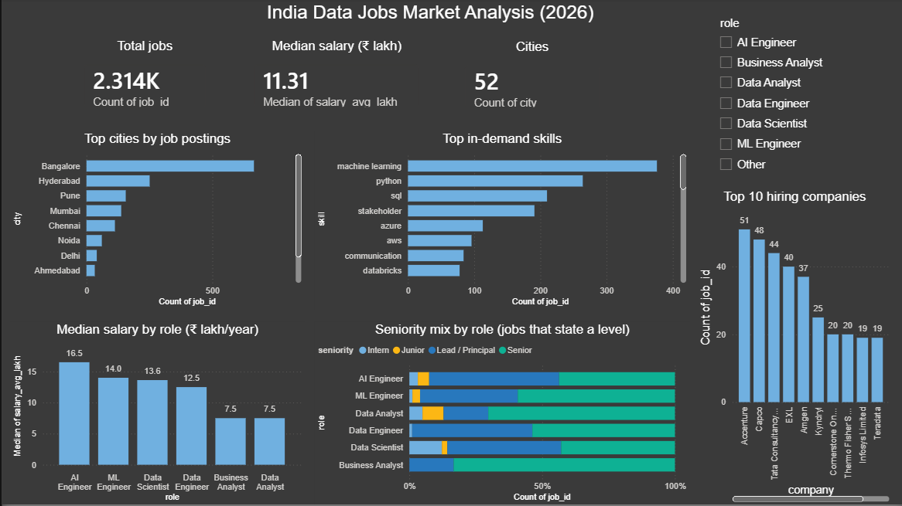

# India Data Jobs Market Analysis (2026)

An end-to-end analysis of **2,314 job postings** for data roles in India: which skills are in demand, which roles and cities pay the most, and how accessible these jobs are for freshers.

## Problem
Students and early-career professionals often don't know which skills to prioritise or what salaries to expect for data roles in India. This project answers those questions using real job-posting data.

## Data
- **Source:** Adzuna Jobs API (India), collected September 2026
- **Roles:** Data Analyst, Business Analyst, Data Scientist, Data Engineer, ML Engineer, AI Engineer
- **Size:** 2,314 unique postings across 52 cities

## Tools
Python (requests, pandas) · SQL (SQLite) · Power BI · Jupyter

## Process
1. **Collection:** Python script calling the Adzuna API with pagination, rate limiting and de-duplication
2. **Cleaning:** converted monthly salaries to yearly, removed unreliable salary values, standardised 400+ location variants into 52 cities, grouped 672 job-title spellings into 6 roles and 5 seniority levels
3. **Skill extraction:** keyword matching on job descriptions for 29 technical and business skills
4. **SQL analysis:** JOINs, CASE WHEN, HAVING to answer business questions
5. **Dashboard:** interactive Power BI report with a role filter

## Key Findings
- **Bangalore dominates:** 665 postings, more than Hyderabad, Pune and Mumbai combined.
- **SQL is the #1 skill for Data Analysts:** mentioned almost twice as often as Python.
- **Business skills matter:** "stakeholder" appears about as often as Python in analyst postings.
- **AI roles pay the most:** AI Engineers have a median offered salary of about ₹16.5 lakh vs ₹7.5 lakh for Data Analysts. Part of this gap reflects seniority, since AI/ML roles have far more senior-level titles.
- **Entry-level titles are rare:** among postings that state a level, senior roles outnumber entry-level roles by roughly 14 to 1.
- **LLM and GenAI skills** appear almost exclusively in AI Engineer postings.
- **Top hirers are IT services and consulting firms** such as Accenture, Capco, TCS and EXL.
- **Pune, Hyderabad and Bangalore pay similarly** (about ₹16 lakh average among salaried postings).

## Limitations
- The API returns shortened job descriptions, so skill percentages are lower than reality. Rankings are more reliable than exact percentages.
- About 75% of postings do not disclose a salary; salary findings are based on 538 postings.
- Seniority is taken from job titles; 71% of titles don't state a level.
- This is a single snapshot in time, capped at 400 postings per role.

## Project Structure
    scripts/collect_jobs.py      Data collection from the Adzuna API
    notebooks/                   Cleaning and skill analysis
    sql/analysis_queries.sql     SQL business questions
    dashboard/                   Power BI file and screenshot

## How to Run
1. Get a free API key at developer.adzuna.com
2. Create a `.env` file with `ADZUNA_APP_ID` and `ADZUNA_APP_KEY`
3. `pip install requests pandas python-dotenv jupyter`
4. `python scripts/collect_jobs.py`
5. Run the notebooks in order, then open the Power BI file

## Author
Anirudhra Pratap Singh Chauhan · M.Sc. Data Science, Symbiosis Skills and Professional University, Pune · [LinkedIn](https://www.linkedin.com/in/anirudhra-singh-chauhan26)